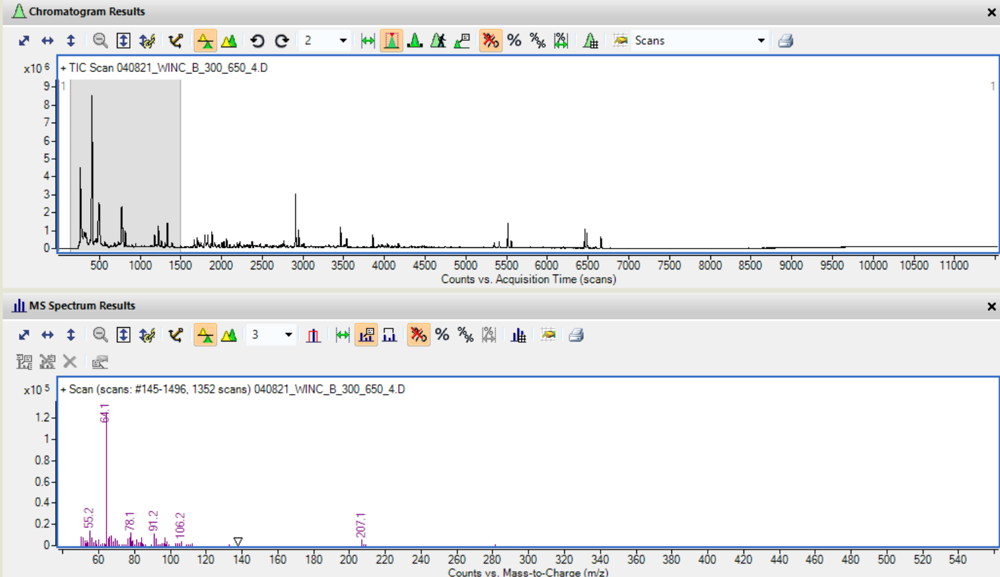
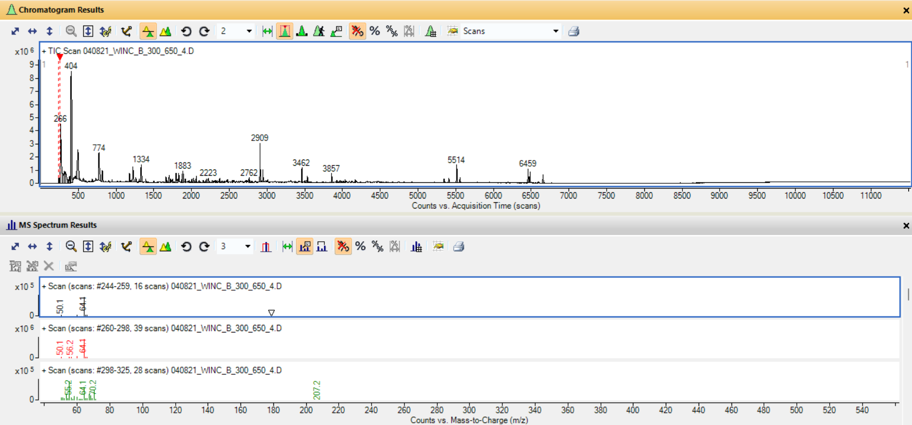
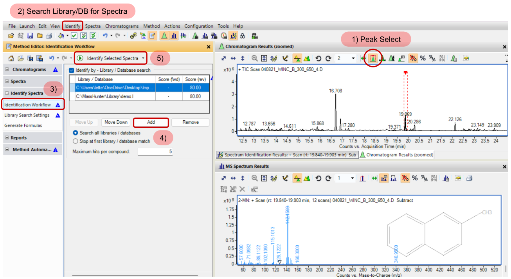

# GC-MS Compound Identification with Agilent MassHunter

### Background: Agilent Technologies & GC-MS

Agilent Technologies is an American company that provides advanced instrumentation and software for life science research. One of their most critical analytical instruments for biosignature detection studies at the Imperial College Organic Geochemistry (ICOG) laboratories is **Gas Chromatography-Mass Spectrometry** (GC-MS). The corresponding **MassHunter** software acquires, processes and analyses GC-MS data in order to identify and quantify compounds.

GC-MS data is three-dimensional (3-D), measuring and storing:
* **Retention Time** (minutes, seconds, scans): Time taken for a compound to travel through the GC column to the detector.
* **Mass-to-Charge ratio** (m/z): Mass of ionised compound fragments detected by MS.
* **Intensity** (counts): Signal abundance of individual ion fragments against time.

Hence, the most relevant tools for handling, processing, and preparing GC-MS data for subsequent computational analysis (i.e., using Python) are **GC MSD Translator** and **Agilent MassHunter Qualitative Analysis Navigator**. I will therefore provide a detailed overview on how these tools are used by applying them on raw exemplar GC-MS data from the Winchcombe meteorite.  

---
### Exemplar Dataset: Winchcombe GC-MS Sample

Among the bespoke biotic and abiotic samples generated within the Imperial College Organic Geochemistry (ICOG) laboratories, the Winchcombe sample served as an exploratory dataset to demonstrate compound identification using Agilent. This work provided a valuable opportunity to familiarise myself with cutting-edge Agilent Gas Chromatography-Mass Spectrometer (GC-MS) software, understand GC-MS data products, and develop preprocessing pipelines that will encompass subsequent machine-learning analyses.

> **Further Information**: The GC-MS data used in this analysis was acquired from a Winchcombe meteorite sample on on 4 August 2021. 

---
### Translating Raw GC-MS Dataset

Raw GC-MS data is stored as a `.D` folder containing binary files specific to Agilent instrumentation. Hence, before this data can be opened and explored in the **Qualitative Navigator**, it must be first translated into a compatible format. There are several Translator tools provided by Agilent. The most suitable for this scenario is **Agilent GC MSD Translator** from the MassHunter suite, whereby the raw Winchcombe GC-MS `.D` data folder is translated and outputed into a processed format readable by the **Qualitative Analysis Navigator**.

> **Further Information**: Please refer to the following link for the [translation log](translation-logs/GCMS-Data-File-Translation-Log.txt) of the raw GC-MS data file used within this documentation.

*Figure 1: Total Ion Chromatogram (top) and MS fragmentation spectrum (bottom) of sample 040821_WINC_B_300_650_4, viewed in Agilent MassHunter Qualitative Analysis Navigator software.*

---
### GC-MS Peak Extraction & Integration
After translating the Winchcombe GC-MS dataset into a readable format, peak extraction and integration is performed in order to find peaks corresponding to compounds in a given chromatogram and extract their individual mass spectra. This is achieved by integrating the area underneath each peak, and computing both the retention time and fragmentation pattern information for each compound.

Performing this in the **Qualitative Analysis Navigator** is shown in Figure 2:
1) Select the Total Ion Chromatogram (TIC) scan which displays all the ion intensities detected by MS across a full mass range over a specified period (seconds, minutes, or scans).
2) Right-click on the TIC scan.
3) Select `Integrate and Extract Peak Spectra`.

*Figure 2: Total Ion Chromatogram displaying the integrated peaks extracted from sample 040821_WINC_B_300_650_4, viewed in Agilent MassHunter Qualitative Analysis Navigator software.*

---
### Compound Identification

Compound identification is achieved by matching detected peaks against a provided spectral library, in order to eventually replace retention times with chemical compounds if desired. The original motivation behind reducing GC-MS data from 3-D to 2-D by replacing retention times with compound identities was rooted in ensuring suitable machine learning (ML) features for subsequent biotic-abiotic classification. Retention times experience instrumental drift between runs due to experimental conditions, such as random fluctuations in temperature and pressure. Hence, there was initial concerns that retetion times were encoding instrument noise rather than chemically meaningful information.

**Spectral Libraries**:

There are two main libraries used here for compound identification:
* The NIST/EPA/NIH Mass Spectral Library (Sparkman, 2017), also known as **NIST17**, is a library used by the ICOG group for compound identification. According to the [Scientific Instrument Services](https://www.sisweb.com/software/ms/nist.htm), NIST17 contains over 306,000 electron ionisation (EI) mass spectra for more than 267,000 compounds, and a wide coverage of lipids, organic acids, and other biologically and geochemically relevant compounds.
* **Custom ICOG Library** compiled by the group to identify compounds in rare or extremophile GC-MS samples that are not well represented in NIST17.

**MassHunter** allows for retention times along with fragmentation patterns to be matched against a given spectral library, stored as an `.L` folder, to identify specific compounds. I therefore use both NIST17 and a custom ICOG spectral library for compound identification in the exemplar Winchcombe GC-MS data.

**Peak Compound Identification: Untargeted Approach**

I will be demonstrating an untargeted approach for compound identification, which involves manually selecting and identifying extracted peaks using the **Qualitative Analysis Navigator**, rather than employing an automated batch approach made available via the **Unknowns Analysis (Quant-My-Way)** tool. Retention time units were switched from `scans` to `minutes`, as this is more consistent with GC-MS literature for identifying compounds.

The example below identifies 2-Methylnaphthalene (2-MN) with formula $C_{11}H_{10}$ at retention time $rt \sim 19.87$ minutes in the exemplar Winchcombe GC-MS dataset, with the following step-by-step guide corresponding to the numbers in Figure 3:
1) Select the button `Peak Select` and then manually choose a peak from the TIC scan. For example, I selected a peak centred at $\sim 19.869$ in Figure 3.
2) Select `Identify >> Search Library/DB for Spectra` at the top taskbar.
3) Select `Identify Spectra >> Identification Workflow` within the Method editor.
4) Select `Add` and search for the spectral library used for compound identification. For example, I select the path to my ICOG custom library for this specific Winchcombe sample.
5) Finally, select `Identify Selected Spectra` to run the workflow which will match the peak's retention time with those compiled in the spectral library in order to identify the compound. Identification details can be found by toggling to the `Spectrum Identification Results` below the TIC Scan.

*Figure 3: Example of compound identification for 2-Methylnaphthalene within sample 040821_WINC_B_300_650_4, viewed in Agilent MassHunter Qualitative Analysis Navigator software.*

---
**Bibliography**

Sparkman OD. Introduction of NIST 17—A Major Update of Mass Spectral Libraries and Software—at the 65th ASMS Conference on Mass Spectrometry and Allied Topics. American Laboratory. August, 2017. [Online] Available: https://www.americanlaboratory.com/913-Technical-Articles/340911-Introduction-of-NIST-17-A-Major-Update-of-Mass-Spectral-Libraries-and-Software-at-the-65th-ASMS-Conference-on-Mass-Spectrometry-and-Allied-Topics/