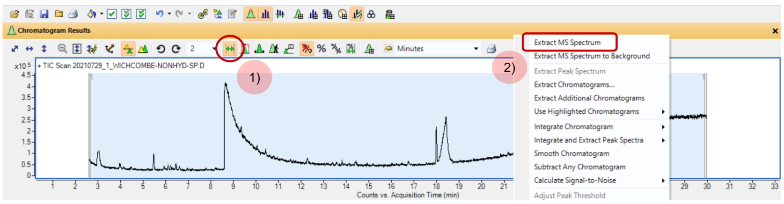
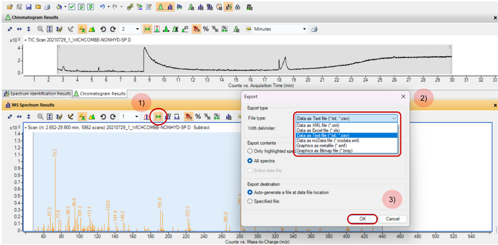

# py-GC-MS Datasets with Agilent MassHunter

### Background: Agilent Technologies & py-GC-MS

*Agilent Technologies* is an American company that provides advanced instrumentation and software for life science research. One of their most critical analytical instruments for biosignature detection studies at the Imperial College Organic Geochemistry (ICOG) laboratories is **Gas Chromatography-Mass Spectrometry** (GC-MS). The corresponding **MassHunter** software acquires, processes and analyses GC-MS and pyrolysis-GC-MS (py-GC-MS) data in order to identify and quantify compounds.

py-GC-MS is a method of chemical analysis whereby a solid sample is heated to decomposition to produce smaller molecules, which are subsequently separated by GC and detected using MS (University of Melbourne, 2026). This method typically requires minimal sample preparation in comparison to GC-MS and therefore avoids intermediate steps, such as solvent extraction and derivatisation, that lead to variation between GC-MS datasets. Furthermore, I intend to reduce py-GC-MS data into py-MS data using Python, thus removing retention time dependencies discussed in previous [documentation](docs/gcms-preparation.md). py-GC-MS data is three-dimensional (3-D), measuring and storing:
* **Retention Time** (minutes, seconds, scans): Time taken for a compound to travel through the GC column to the detector.
* **Mass-to-Charge ratio** (m/z): Mass of ionised compound fragments detected by MS.
* **Intensity** (counts): Signal abundance of individual ion fragments against time.

Hence, the most relevant tools for handling, processing, and preparing py-GC-MS data into py-MS data for subsequent computational analysis (i.e., using Python) are **GC MSD Translator** and **Agilent MassHunter Qualitative Analysis Navigator**. I will therefore provide a detailed overview on how these tools are used by applying them on raw exemplar py-GC-MS data from the Winchcombe meteorite.

---
### Exemplar Dataset: Winchcombe py-GC-MS Sample

Among the bespoke biotic and abiotic samples generated within the Imperial College Organic Geochemistry (ICOG) laboratories, this Winchcombe sample served as an exploratory dataset to develop an initial framework for handling py-GC-Ms data, perform preprocessing, and create features for a machine learning (ML) pipeline.

> **Further Information**: The py-GC-MS data used in this analysis was acquired from a Winchcombe meteorite sample on 29 July 2021. It is a non-hydrolysed sample, meaning it undergoes limited chemical modification before being analysed in order to ensure the molecular composition is largely unchanged and maintain consistency across lab-generated datasets. 

---
### Translating Raw py-GC-MS Dataset

Raw py-GC-MS data is stored as a `.D` folder containing binary files specific to Agilent instrumentation. Hence, before this data can be opened and explored in the **Qualitative Analysis Navigator**, it must be first translated into a compatible format. There are several Translator tools provided by Agilent. The most suitable for this scenario is **Agilent GC MSD Translator** from the MassHunter suite, whereby the raw Winchcombe py-GC-MS `.D` data folder is translated and outputed into a processed format readable by the **Qualitative Analysis Navigator**.

> **Further Information**: Please refer to the following link for the [translation log](translation-logs/py-GCMS-Data-File-Translation-Log.txt) of the raw py-GC-MS data file used within this documentation.

---
### Extracting Mass Spectrum
After translating the Winchcombe py-GC-MS dataset into a readable format, mass spectrum ('MS Spectrum') extraction is performed. At each scan interval, the MS captures a mass spectrum (m/z $\times$ intensity) which represents all ion fragments detected at that specific retention time. As the Agilent instrumentation utilised in ICOG has a 3 Hz scan rate, an MS Spectrum is captured at 3 scans/second.

Extracting all the MS Spectrums for a given Total Ion Chromatogram (TIC) of a sample in the **Qualitative Analysis Navigator** is shown below in Figure 1:
1) Choose the desired Total Ion Chromatogram (TIC) scan which displays all the ion intensities detected by MS across a full mass range over a specified period (seconds, minutes, or scans). Click the `Range Select` tool and drag the tool across the span of the TIC scan. 
2) Select `Extract MS Spectrum` for the entire TIC scan.

*Figure 1: Extracting MS Spectrum from Total Ion Chromatogram (TIC) scan of sample 20210729_1_WICHCOMBE-NONHYD-SP, viewed in Agilent MassHunter Qualitative Analysis Navigator software.*

---
### Exporting Mass Spectrum to CSV Files

In order to remove dependencies on retention time, the MS Spectrum for each compound in a given sample can be exported into a file, such as a Comma Separated Values (CSV) file. This therefore stores two-dimensional mass spectral data that can be directly handled, processed, and manipulated in Python. Upon exportation from **Agilent** software, this file stores:
* **Point**: Tracking where a mass spectrum begins and ends.
* **X(Thomsons)**: Mass of ionised compound fragments detected by MS
* **Y(Counts)**: Signal abundance of individual ion fragments at each m/z value within a given scan.

A step-by-step guide for exporting the mass spectral data to a CSV file is provided below in Figure 2:
1) Click the `Range Select` tool and drag the tool across the span of the extracted mass spectra in the MS Spectrum panel. 
2) Right-click on the selected mass spectra, and select `Export`.
3) Choose the desired file type to export the mass spectral data i.e., `.csv` in Figure 2, and select `OK` when satisfied.

*Figure 2: Exporting MS Spectrum to a CSV file for sample 20210729_1_WICHCOMBE-NONHYD-SP, viewed in Agilent MassHunter Qualitative Analysis Navigator software.*

The `Point` variable is essentially an index that resets at the beginning of a new scan, and therefore new MS Spectrum, captured at a different retention time. An example of the `Point` variable resetting is shown below from the [CSV file](../exploratory/data/winchcombe-nonhyd-sp.CSV) of the exemplar Winchcombe py-GC-MS dataset used in this documentation:

| Point | X(Thomsons) | Y(Counts) |
|---|---|---|
| 81 | 429.0 | 322 |
| 82 | 431.2 | 189 |
| 0 | 50.1 | 364 |
| 1 | 51.1 | 433 |

---
**Bibliography**

University of Melbourne. Pyrolysis Gas Chromatography Mass Spectrometry (Py-GCMS). Melbourne TrACEES Platform. Accessed June 17, 2026. https://sites.research.unimelb.edu.au/tracees/capabilities/chemistry-node/py-gcms